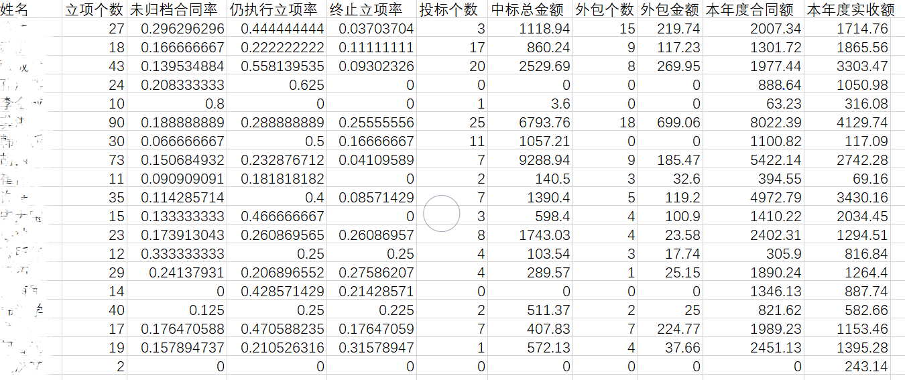

# 项目经理绩效评价算法

## 1. 项目经理年度数据汇总

- 立项数据
  - 立项个数 （立项个数 = 已签订合同 + 未归档合同 + 仍执行立项 + 终止立项）
  - 已签订合同数
  - 未归档合同数
  - 仍执行立项数
  - 终止立项数

- 投标数据
  - 投标个数
  - 中标金额
  - 个人中标金额占部门总比

- 外包项目数据
  - 外包项目个数
  - 外报项目金额
  - 个人外包金额占部门总比

- 成本管理数据
  - 合同额
  - 实收额

## 2. 评价指标定性分析

| 类别         | 指标                   | 与绩效成正/反比                                    |
| ------------ | ---------------------- | -------------------------------------------------- |
| 立项相关     | 立项个数               | 正比                                               |
|              | 已签订合同数           | 立项未必都会签订合同，因此与绩效没有明显相关性     |
|              | 未归档合同数           | 反比                                               |
|              | 仍执行立项数           | 正比                                               |
|              | 终止立项数             | 反比                                               |
| 投标相关     | 投标个数               | 正比                                               |
|              | 中标金额               | 正比                                               |
|              | 个人中标金额占部门总比 | 与绩效成正比，但其作用与中标金额重合，二者可取其一 |
| 外包项目相关 | 外包项目个数           | 反比                                               |
|              | 外包金额               | 反比                                               |
|              | 个人外包金额占部门总比 | 与绩效成反比，但其作用与外包金额重合，二者可取其一 |
| 成本管理相关 | 合同额                 | 正比                                               |
|              | 实收额                 | 正比                                               |

## 3. 评价指标选取构建

| 指标名称                               | 指标占绩效权重 | 与绩效成正/反比 |
| -------------------------------------- | -------------- | --------------- |
| A.立项个数                             | 0.2            | 正比            |
| B. 未归档合同数/立项个数 （/代表除号） | 0.066          | 反比            |
| C. 仍执行立项数/立项个数               | 0.066          | 正比            |
| D.终止立项数/立项个数                  | 0.066          | 反比            |
| E.投标个数                             | 0.1            | 正比            |
| F.中标金额                             | 0.1            | 正比            |
| G.外包项目个数                         | 0.1            | 反比            |
| H.外包金额                             | 0.1            | 反比            |
| I.合同额                               | 0.1            | 正比            |
| J.实收额                               | 0.1            | 正比            |

## 4. 定量指标归一化算法

### （1）效益型量化指标归一化模型

符合效益型量化指标的有：A，C，E，F，I，J（与绩效成正比）。

效益型量化指标隶属度函数图：

函数模型：

其中：

### （2）成本型量化指标归一化模型

符合成本型量化指标的有：B，D，G，H（与绩效成反比）。

成本型量化指标隶属度函数图：

函数模型：

其中：

## 5. 输入Excel数据文件格式示例：

## 6. 输出绩效结果示例：

